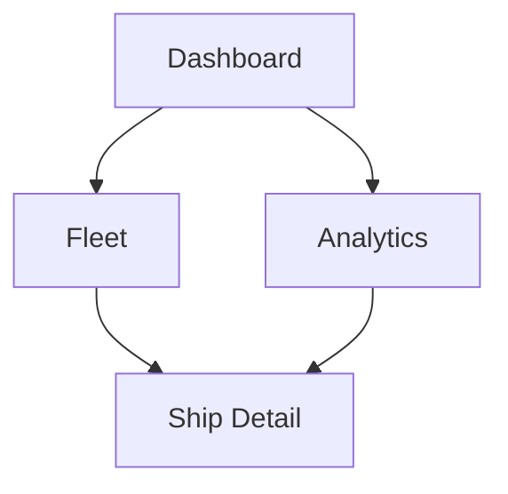

# 📸 Guia para Gerar Imagens do Wireframe

Este guia explica como converter os diagramas Mermaid do `WIREFRAME.md` em imagens (PNG, SVG, PDF).

## 🎯 Métodos Disponíveis

### 1. **Mermaid Live Editor** (Mais Fácil) ⭐ RECOMENDADO

1. Acesse: https://mermaid.live/
2. Copie o código de um diagrama Mermaid do `WIREFRAME.md`
3. Cole no editor
4. Clique em **"Actions"** → **"Download PNG"** ou **"Download SVG"**

**Vantagens:**
- ✅ Gratuito
- ✅ Não precisa instalar nada
- ✅ Suporta PNG e SVG
- ✅ Interface visual

---

### 2. **GitHub/GitLab** (Automático)

Se você fizer commit do `WIREFRAME.md` no GitHub ou GitLab, os diagramas Mermaid serão renderizados automaticamente!

**Passos:**
1. Faça commit do arquivo `WIREFRAME.md`
2. Abra o arquivo no GitHub/GitLab
3. Os diagramas aparecerão como imagens automaticamente
4. Clique com botão direito → "Salvar imagem como..."

**Vantagens:**
- ✅ Automático
- ✅ Não precisa fazer nada além de commitar
- ✅ Renderização perfeita

---

### 3. **VS Code com Extensão**

1. Instale a extensão: **"Markdown Preview Mermaid Support"**
2. Abra o `WIREFRAME.md` no VS Code
3. Pressione `Ctrl+Shift+V` (ou `Cmd+Shift+V` no Mac) para preview
4. Clique com botão direito nos diagramas → "Salvar imagem"

**Vantagens:**
- ✅ Integrado ao editor
- ✅ Preview em tempo real
- ✅ Fácil de usar

---

### 4. **Ferramentas Online de Conversão**

#### a) **Mermaid.ink** (API)
- URL: https://mermaid.ink/
- Use a API para gerar imagens via URL
- Exemplo: `https://mermaid.ink/img/...`

#### b) **Kroki** (Online)
- URL: https://kroki.io/
- Suporta Mermaid e outros formatos
- Interface web simples

---

### 5. **CLI (Linha de Comando)**

#### Instalar Mermaid CLI:
```bash
npm install -g @mermaid-js/mermaid-cli
```

#### Gerar imagem:
```bash
mmdc -i diagrama.mmd -o diagrama.png
```

**Vantagens:**
- ✅ Automatizável
- ✅ Bom para múltiplos diagramas
- ✅ Controle total

---

## 📋 Lista de Diagramas Disponíveis

No arquivo `WIREFRAME.md` você encontrará os seguintes diagramas Mermaid:

1. **Estrutura Geral do Layout** - Layout principal com Header e Sidebar
2. **Fluxo de Navegação** - Como navegar entre páginas
3. **Dashboard** - Estrutura da página inicial
4. **Frota** - Estrutura da página de frota
5. **Detalhes do Navio** - Estrutura da página de detalhes
6. **ShipCard** - Componente de card de navio
7. **Níveis de Bioincrustação** - Sistema de cores e status
8. **Fluxo de Visualização** - Sequência de interações
9. **Comparar Navios** - Fluxo de comparação
10. **Exportar Dados** - Fluxo de exportação
11. **Responsividade** - Breakpoints e layouts responsivos

---

## 🎨 Dicas para Melhor Qualidade

### Para PNG:
- Use resolução alta (2x ou 3x)
- Configure o tema no Mermaid Live Editor
- Escolha fundo branco para melhor impressão

### Para SVG:
- Melhor para web e documentos
- Escalável sem perda de qualidade
- Menor tamanho de arquivo

### Para PDF:
- Use ferramentas de conversão SVG → PDF
- Mantém qualidade vetorial
- Ideal para documentação impressa

---

## 🚀 Exemplo Rápido

### Passo a Passo (Mermaid Live Editor):

1. **Abra**: https://mermaid.live/
2. **Copie** este código de exemplo:

3. **Cole** no editor
4. **Clique** em "Actions" → "Download PNG"
5. **Pronto!** Imagem salva

---

## 📝 Notas Importantes

- Os diagramas Mermaid são renderizados automaticamente no GitHub/GitLab
- Para melhor qualidade, use o Mermaid Live Editor
- SVG é recomendado para documentos técnicos
- PNG é melhor para apresentações e documentos Word

---

## 🔗 Links Úteis

- **Mermaid Live Editor**: https://mermaid.live/
- **Documentação Mermaid**: https://mermaid.js.org/
- **Mermaid.ink API**: https://mermaid.ink/
- **Kroki**: https://kroki.io/

---

## 💡 Dica Pro

Se você precisar gerar muitas imagens de uma vez, use o Mermaid CLI com um script:

```bash
# Criar script para gerar todas as imagens
for file in *.mmd; do
    mmdc -i "$file" -o "${file%.mmd}.png"
done
```

Isso gerará todas as imagens automaticamente!

