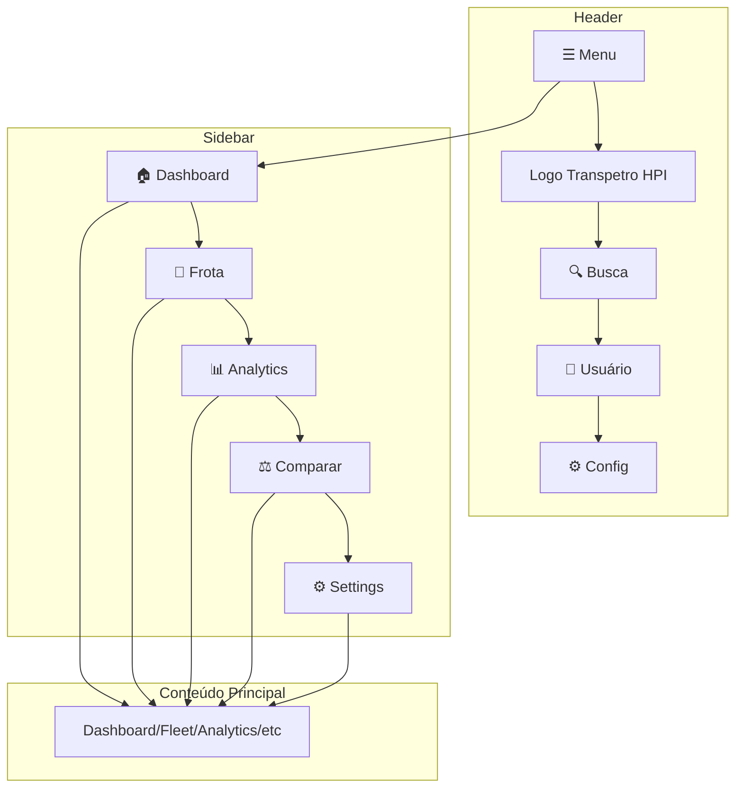
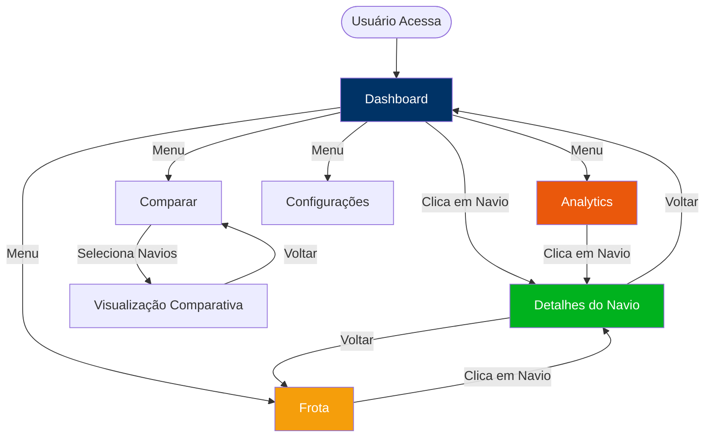
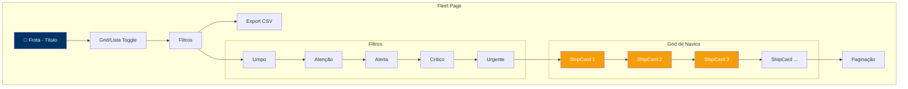
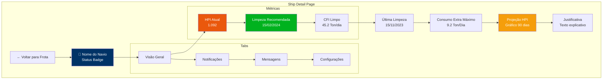
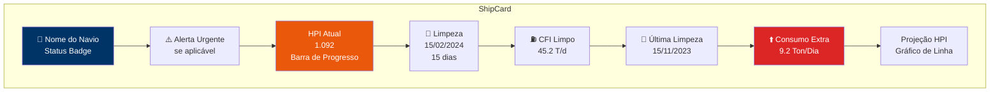
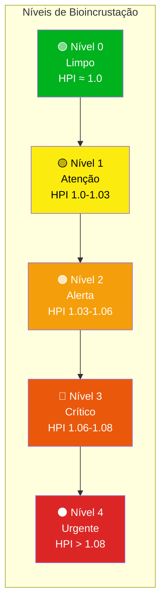
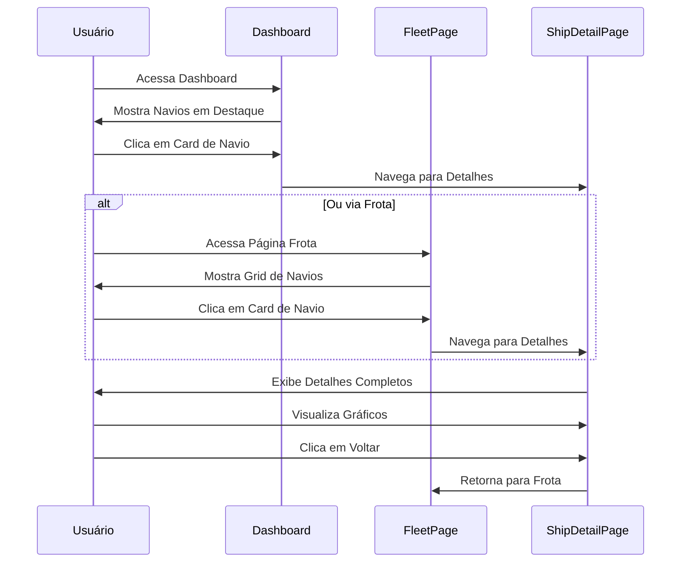
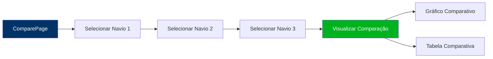
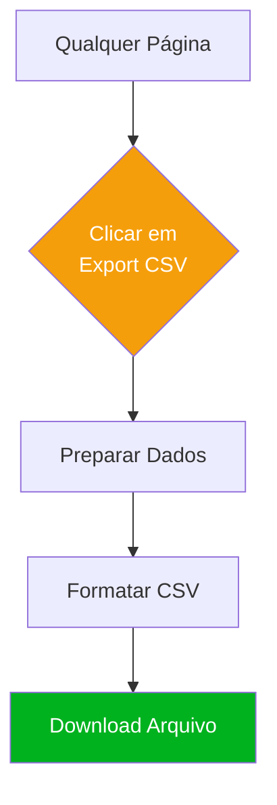

# 🎨 Wireframe do Sistema - Otimização Preditiva de Limpeza de Casco (HPI)

> **💡 Dica**: Este documento contém diagramas Mermaid que podem ser visualizados em:
> - GitHub/GitLab (renderização automática)
> - [Mermaid Live Editor](https://mermaid.live/)
> - Extensões do VS Code (Markdown Preview Mermaid Support)
> - Ferramentas online de conversão para PNG/SVG

## 📐 Estrutura Geral do Layout

### Diagrama Mermaid - Layout Principal



### Diagrama de Fluxo de Navegação



## 📐 Estrutura Geral do Layout

```
┌─────────────────────────────────────────────────────────────────┐
│                         HEADER                                   │
│  [☰] Logo  |  [🔍 Busca]  |  [👤 Usuário]  |  [⚙️ Config]      │
├──────────┬───────────────────────────────────────────────────────┤
│          │                                                       │
│ SIDEBAR  │                    CONTEÚDO                          │
│          │                                                       │
│ [🏠]     │                                                       │
│ Dashboard│                                                       │
│          │                                                       │
│ [🚢]     │                                                       │
│ Frota    │                                                       │
│          │                                                       │
│ [📊]     │                                                       │
│ Analytics│                                                       │
│          │                                                       │
│ [⚖️]     │                                                       │
│ Comparar │                                                       │
│          │                                                       │
│ [⚙️]     │                                                       │
│ Settings │                                                       │
│          │                                                       │
└──────────┴───────────────────────────────────────────────────────┘
```

---

## 🏠 PÁGINA: Dashboard (Home)

### Diagrama Mermaid - Estrutura do Dashboard

```mermaid
graph TB
    subgraph "Header"
        H1[☰ Menu] --> H2[Logo] --> H3[🔍 Busca] --> H4[👤]
    end
    
    subgraph "Sidebar"
        S1[🏠 Dashboard ✓]
        S2[🚢 Frota]
        S3[📊 Analytics]
        S4[⚖️ Comparar]
        S5[⚙️ Settings]
    end
    
    subgraph "Dashboard Content"
        D1[📅 Data e Título]
        D2[Fleet Overview<br/>Total: 21 | Crítico: 5 | Limpo: 12 | Urgente: 2]
        D3[Análise de Distribuição<br/>Gráfico de Pizza]
        D4[Alertas Recentes<br/>Lista de Navios Críticos]
        D5[Navios em Destaque<br/>Grid de Cards]
    end
    
    H1 --> S1
    S1 --> D1
    D1 --> D2
    D2 --> D3
    D3 --> D4
    D4 --> D5
    
    style S1 fill:#003366,color:#fff
    style D2 fill:#00b21e,color:#fff
    style D3 fill:#f59e0b,color:#fff
    style D4 fill:#ea580c,color:#fff
```

## 🏠 PÁGINA: Dashboard (Home)

```
┌─────────────────────────────────────────────────────────────────┐
│ HEADER: [☰] Transpetro HPI  |  [🔍 Buscar navio...]  |  [👤]   │
├──────────┬───────────────────────────────────────────────────────┤
│          │                                                       │
│ SIDEBAR  │  📅 Segunda-feira, 15 de Janeiro de 2024             │
│          │  ────────────────────────────────────────────────   │
│ [🏠] ✓   │  Dashboard                                            │
│ [🚢]     │  Visão geral da performance e status da frota        │
│ [📊]     │                                                       │
│ [⚖️]     │  ┌─────────────────────────────────────────────┐   │
│ [⚙️]     │  │  FLEET OVERVIEW                              │   │
│          │  │  ┌──────┐ ┌──────┐ ┌──────┐ ┌──────┐      │   │
│          │  │  │Total │ │Crítico│ │Limpo │ │Urgente│      │   │
│          │  │  │  21  │ │   5   │ │  12  │ │   2   │      │   │
│          │  │  └──────┘ └──────┘ └──────┘ └──────┘      │   │
│          │  └─────────────────────────────────────────────┘   │
│          │                                                       │
│          │  ┌──────────────────────┬──────────────────────┐   │
│          │  │  ANÁLISE DE          │  ALERTAS RECENTES    │   │
│          │  │  DISTRIBUIÇÃO        │  ──────────────────  │   │
│          │  │                      │                      │   │
│          │  │  [Gráfico de Pizza]  │  🚨 Bruno Lima      │   │
│          │  │                      │     HPI: 1.092      │   │
│          │  │  Limpo: 12           │     • 15 dias       │   │
│          │  │  Atenção: 2          │                      │   │
│          │  │  Alerta: 4           │  🚨 Carla Silva      │   │
│          │  │  Crítico: 3           │     HPI: 1.085      │   │
│          │  │  Urgente: 2          │     • 22 dias       │   │
│          │  │                      │                      │   │
│          │  └──────────────────────┴──────────────────────┘   │
│          │                                                       │
│          │  ┌─────────────────────────────────────────────┐   │
│          │  │  NAVIOS EM DESTAQUE                        │   │
│          │  │  [Ver Todas as Frotas →]                   │   │
│          │  │                                             │   │
│          │  │  ┌──────────┐ ┌──────────┐ ┌──────────┐  │   │
│          │  │  │ 🚢 Bruno │ │ 🚢 Carla │ │ 🚢 Daniel│  │   │
│          │  │  │   Lima   │ │  Silva    │ │  Pereira │  │   │
│          │  │  │          │ │           │ │          │  │   │
│          │  │  │ HPI: 1.09│ │ HPI: 1.08│ │ HPI: 1.07│  │   │
│          │  │  │ [🔴]     │ │ [🔴]     │ │ [🟠]     │  │   │
│          │  │  │          │ │           │ │          │  │   │
│          │  │  │ Limpeza: │ │ Limpeza: │ │ Limpeza: │  │   │
│          │  │  │ 15/02/24 │ │ 22/02/24 │ │ 28/02/24 │  │   │
│          │  │  │          │ │           │ │          │  │   │
│          │  │  │ [Gráfico]│ │ [Gráfico]│ │ [Gráfico]│  │   │
│          │  │  └──────────┘ └──────────┘ └──────────┘  │   │
│          │  │                                             │   │
│          │  │  ┌──────────┐ ┌──────────┐ ┌──────────┐  │   │
│          │  │  │ ...      │ │ ...      │ │ ...      │  │   │
│          │  │  └──────────┘ └──────────┘ └──────────┘  │   │
│          │  └─────────────────────────────────────────────┘   │
│          │                                                       │
└──────────┴───────────────────────────────────────────────────────┘
```

---

## 🚢 PÁGINA: Frota (Fleet)

### Diagrama Mermaid - Estrutura da Página Frota



## 🚢 PÁGINA: Frota (Fleet)

```
┌─────────────────────────────────────────────────────────────────┐
│ HEADER: [☰] Transpetro HPI  |  [🔍 Buscar navio...]  |  [👤]   │
├──────────┬───────────────────────────────────────────────────────┤
│          │                                                       │
│ SIDEBAR  │  🚢 Frota                                             │
│          │  ────────────────────────────────────────────────   │
│ [🏠]     │                                                       │
│ [🚢] ✓   │  [Grid] [Lista]  |  [Filtros ▼]  |  [Export CSV]    │
│ [📊]     │                                                       │
│ [⚖️]     │  ┌─────────────────────────────────────────────┐   │
│ [⚙️]     │  │  FILTROS                                     │   │
│          │  │  [ ] Limpo  [ ] Atenção  [ ] Alerta          │   │
│          │  │  [ ] Crítico  [ ] Urgente                    │   │
│          │  └─────────────────────────────────────────────┘   │
│          │                                                       │
│          │  ┌──────────┐ ┌──────────┐ ┌──────────┐          │
│          │  │ 🚢 Bruno │ │ 🚢 Carla │ │ 🚢 Daniel│          │
│          │  │   Lima   │ │  Silva    │ │  Pereira │          │
│          │  │          │ │           │ │          │          │
│          │  │ HPI: 1.09│ │ HPI: 1.08│ │ HPI: 1.07│          │
│          │  │ [🔴]     │ │ [🔴]     │ │ [🟠]     │          │
│          │  │          │ │           │ │          │          │
│          │  │ Limpeza: │ │ Limpeza: │ │ Limpeza: │          │
│          │  │ 15/02/24 │ │ 22/02/24 │ │ 28/02/24 │          │
│          │  │          │ │           │ │          │          │
│          │  │ [Gráfico]│ │ [Gráfico]│ │ [Gráfico]│          │
│          │  └──────────┘ └──────────┘ └──────────┘          │
│          │                                                       │
│          │  ┌──────────┐ ┌──────────┐ ┌──────────┐          │
│          │  │ ...      │ │ ...      │ │ ...      │          │
│          │  └──────────┘ └──────────┘ └──────────┘          │
│          │                                                       │
│          │  [1] [2] [3] ... [5]  (Paginação)                   │
│          │                                                       │
└──────────┴───────────────────────────────────────────────────────┘
```

**Modo Lista:**
```
┌─────────────────────────────────────────────────────────────────┐
│  🚢 Bruno Lima    │ HPI: 1.092 │ Limpeza: 15/02 │ [🔴] [→]    │
│  🚢 Carla Silva   │ HPI: 1.085 │ Limpeza: 22/02 │ [🔴] [→]    │
│  🚢 Daniel Pereira│ HPI: 1.074 │ Limpeza: 28/02 │ [🟠] [→]    │
│  ...                                                             │
└─────────────────────────────────────────────────────────────────┘
```

---

## 📊 PÁGINA: Analytics

```
┌─────────────────────────────────────────────────────────────────┐
│ HEADER: [☰] Transpetro HPI  |  [🔍 Buscar navio...]  |  [👤]   │
├──────────┬───────────────────────────────────────────────────────┤
│          │                                                       │
│ SIDEBAR  │  📊 Analytics                                         │
│          │  ────────────────────────────────────────────────   │
│ [🏠]     │                                                       │
│ [🚢]     │  ┌─────────────────────────────────────────────┐   │
│ [📊] ✓   │  │  ESTATÍSTICAS GERAIS                          │   │
│ [⚖️]     │  │  ┌──────┐ ┌──────┐ ┌──────┐ ┌──────┐        │   │
│ [⚙️]     │  │  │Total │ │Crítico│ │Limpo │ │Urgente│        │   │
│          │  │  │  21  │ │   5   │ │  12  │ │   2   │        │   │
│          │  │  └──────┘ └──────┘ └──────┘ └──────┘        │   │
│          │  └─────────────────────────────────────────────┘   │
│          │                                                       │
│          │  ┌─────────────────────────────────────────────┐   │
│          │  │  DISTRIBUIÇÃO POR NÍVEL                      │   │
│          │  │  [Gráfico de Pizza]                          │   │
│          │  │  Limpo: 12 (57%)                             │   │
│          │  │  Atenção: 2 (10%)                            │   │
│          │  │  Alerta: 4 (19%)                              │   │
│          │  │  Crítico: 3 (14%)                             │   │
│          │  └─────────────────────────────────────────────┘   │
│          │                                                       │
│          │  ┌─────────────────────────────────────────────┐   │
│          │  │  TENDÊNCIA DE HPI                           │   │
│          │  │  [Gráfico de Barras/Linha]                  │   │
│          │  │  [Todos] [Críticos] [Limpos]                │   │
│          │  └─────────────────────────────────────────────┘   │
│          │                                                       │
│          │  ┌─────────────────────────────────────────────┐   │
│          │  │  TOP 10 NAVIOS CRÍTICOS                    │   │
│          │  │  ┌─────────────────────────────────────┐ │   │
│          │  │  │ 1. Bruno Lima      HPI: 1.092 [🔴]  │ │   │
│          │  │  │ 2. Carla Silva     HPI: 1.085 [🔴]  │ │   │
│          │  │  │ 3. Daniel Pereira  HPI: 1.074 [🟠]  │ │   │
│          │  │  │ ...                                   │ │   │
│          │  │  └─────────────────────────────────────┘ │   │
│          │  └─────────────────────────────────────────────┘   │
│          │                                                       │
│          │  [📥 Export CSV]                                    │
│          │                                                       │
└──────────┴───────────────────────────────────────────────────────┘
```

---

## ⚖️ PÁGINA: Comparar

```
┌─────────────────────────────────────────────────────────────────┐
│ HEADER: [☰] Transpetro HPI  |  [🔍 Buscar navio...]  |  [👤]   │
├──────────┬───────────────────────────────────────────────────────┤
│          │                                                       │
│ SIDEBAR  │  ⚖️ Comparar Navios                                   │
│          │  ────────────────────────────────────────────────   │
│ [🏠]     │                                                       │
│ [🚢]     │  [Selecione navios para comparar]                    │
│ [📊]     │                                                       │
│ [⚖️] ✓   │  ┌─────────────────────────────────────────────┐   │
│ [⚙️]     │  │  NAVIO 1: [Dropdown ▼]                      │   │
│          │  │  NAVIO 2: [Dropdown ▼]                      │   │
│          │  │  NAVIO 3: [Dropdown ▼]                      │   │
│          │  │  [+ Adicionar Navio]                        │   │
│          │  └─────────────────────────────────────────────┘   │
│          │                                                       │
│          │  ┌─────────────────────────────────────────────┐   │
│          │  │  COMPARAÇÃO                                 │   │
│          │  │                                             │   │
│          │  │  ┌──────────┬──────────┬──────────┐       │   │
│          │  │  │          │ Bruno    │ Carla    │       │   │
│          │  │  │          │ Lima     │ Silva    │       │   │
│          │  │  ├──────────┼──────────┼──────────┤       │   │
│          │  │  │ HPI      │ 1.092    │ 1.085    │       │   │
│          │  │  │ Nível    │ [🔴]     │ [🔴]     │       │   │
│          │  │  │ Limpeza  │ 15/02/24 │ 22/02/24 │       │   │
│          │  │  │ CFI      │ 45.2 T/d │ 38.5 T/d │       │   │
│          │  │  │ Consumo  │ 9.2 T/d  │ 7.8 T/d  │       │   │
│          │  │  │ Extra    │          │          │       │   │
│          │  │  └──────────┴──────────┴──────────┘       │   │
│          │  │                                             │   │
│          │  │  [Gráfico Comparativo de HPI]              │   │
│          │  └─────────────────────────────────────────────┘   │
│          │                                                       │
└──────────┴───────────────────────────────────────────────────────┘
```

---

## 🚢 PÁGINA: Detalhes do Navio

### Diagrama Mermaid - Estrutura da Página de Detalhes



## 🚢 PÁGINA: Detalhes do Navio

```
┌─────────────────────────────────────────────────────────────────┐
│ HEADER: [☰] Transpetro HPI  |  [🔍 Buscar navio...]  |  [👤]   │
├──────────┬───────────────────────────────────────────────────────┤
│          │  [← Voltar para Frota]                               │
│ SIDEBAR  │                                                       │
│          │  ┌─────────────────────────────────────────────┐   │
│ [🏠]     │  │  🚢 Bruno Lima                                │   │
│ [🚢]     │  │  🟢 LIMPO (Sem bioincrustação)                │   │
│ [📊]     │  │  [Status Badge]                              │   │
│ [⚖️]     │  └─────────────────────────────────────────────┘   │
│ [⚙️]     │                                                       │
│          │  [Visão Geral] [Notificações] [Mensagens] [Config]  │
│          │  ────────────────────────────────────────────────   │
│          │                                                       │
│          │  ┌──────────┐ ┌──────────┐ ┌──────────┐          │
│          │  │ HPI Atual│ │ Limpeza  │ │ CFI     │          │
│          │  │ 1.092    │ │ Recomend.│ │ Limpo   │          │   │
│          │  │ [Barra]  │ │ 15/02/24 │ │ 45.2    │          │   │
│          │  │          │ │ 15 dias  │ │ Ton/dia │          │   │
│          │  └──────────┘ └──────────┘ └──────────┘          │
│          │                                                       │
│          │  ┌─────────────────────────────────────────────┐   │
│          │  │  Última Limpeza: 15/11/2023                 │   │
│          │  └─────────────────────────────────────────────┘   │
│          │                                                       │
│          │  ┌─────────────────────────────────────────────┐   │
│          │  │  Consumo Extra Máximo: 9.2 Ton/Dia         │   │
│          │  └─────────────────────────────────────────────┘   │
│          │                                                       │
│          │  ┌─────────────────────────────────────────────┐   │
│          │  │  Projeção HPI (90 dias)                      │   │
│          │  │  [Gráfico de Linha]                         │   │
│          │  │  HPI ao longo do tempo                      │   │
│          │  └─────────────────────────────────────────────┘   │
│          │                                                       │
│          │  ┌─────────────────────────────────────────────┐   │
│          │  │  Justificativa                              │   │
│          │  │  Data de limpeza sugerida: HPI projetado    │   │
│          │  │  atingiu o limite de performance dinâmico... │   │
│          │  └─────────────────────────────────────────────┘   │
│          │                                                       │
└──────────┴───────────────────────────────────────────────────────┘
```

---

## ⚙️ PÁGINA: Configurações

```
┌─────────────────────────────────────────────────────────────────┐
│ HEADER: [☰] Transpetro HPI  |  [🔍 Buscar navio...]  |  [👤]   │
├──────────┬───────────────────────────────────────────────────────┤
│          │                                                       │
│ SIDEBAR  │  ⚙️ Configurações                                    │
│          │  ────────────────────────────────────────────────   │
│ [🏠]     │                                                       │
│ [🚢]     │  ┌─────────────────────────────────────────────┐   │
│ [📊]     │  │  PREFERÊNCIAS                                │   │
│ [⚖️]     │  │  ─────────────────────────────────────────  │   │
│ [⚙️] ✓   │  │                                             │   │
│          │  │  Tema: [Claro] [Escuro] [Automático]        │   │
│          │  │                                             │   │
│          │  │  Idioma: [Português ▼]                      │   │
│          │  │                                             │   │
│          │  │  Notificações: [✓] Ativar notificações      │   │
│          │  │  Frequência: [Diária ▼]                     │   │
│          │  └─────────────────────────────────────────────┘   │
│          │                                                       │
│          │  ┌─────────────────────────────────────────────┐   │
│          │  │  LIMITES E ALERTAS                           │   │
│          │  │  ─────────────────────────────────────────  │   │
│          │  │                                             │   │
│          │  │  Limite Crítico HPI: [1.08]                 │   │
│          │  │  Limite Alerta HPI: [1.06]                 │   │
│          │  │                                             │   │
│          │  │  Dias para Alerta: [30] dias antes         │   │
│          │  └─────────────────────────────────────────────┘   │
│          │                                                       │
│          │  ┌─────────────────────────────────────────────┐   │
│          │  │  EXPORTAÇÃO                                 │   │
│          │  │  ─────────────────────────────────────────  │   │
│          │  │                                             │   │
│          │  │  Formato padrão: [CSV ▼]                    │   │
│          │  │  Incluir gráficos: [✓]                      │   │
│          │  └─────────────────────────────────────────────┘   │
│          │                                                       │
│          │  [💾 Salvar Configurações]                          │
│          │                                                       │
└──────────┴───────────────────────────────────────────────────────┘
```

---

## 🎯 COMPONENTES PRINCIPAIS

### Diagrama Mermaid - Componente ShipCard



### ShipCard (Card de Navio)
```
┌─────────────────────────┐
│ 🚢 Bruno Lima      [🔴] │
│                         │
│ ⚠️ Ação urgente         │
│ necessária              │
│                         │
│ ┌───────────────────┐  │
│ │ HPI Atual         │  │
│ │ 1.092             │  │
│ │ [Barra Progresso] │  │
│ │ 1.00 ───── 1.08   │  │
│ └───────────────────┘  │
│                         │
│ ┌──────┐ ┌──────┐      │
│ │📅    │ │⛽    │      │
│ │Limpeza│ │CFI  │      │
│ │15/02 │ │45.2 │      │
│ │15 dias│ │T/d  │      │
│ └──────┘ └──────┘      │
│                         │
│ ┌───────────────────┐  │
│ │ 📅 Última Limpeza │  │
│ │ 15/11/2023        │  │
│ └───────────────────┘  │
│                         │
│ ┌───────────────────┐  │
│ │ ⬆️ Consumo Extra  │  │
│ │ 9.2 Ton/Dia       │  │
│ └───────────────────┘  │
│                         │
│ Projeção HPI (90 dias)  │
│ [Gráfico de Linha]      │
└─────────────────────────┘
```

### ShipModal (Modal de Detalhes)
```
        ┌─────────────────────────────────────┐
        │ 🚢 Bruno Lima              [X]      │
        │ 🟢 LIMPO (Sem bioincrustação)       │
        ├─────────────────────────────────────┤
        │                                     │
        │ ┌──────────┐ ┌──────────┐ ┌──────┐│
        │ │📅 Limpeza│ │⛽ CFI    │ │⬆️    ││
        │ │ Sugerida │ │ Limpo    │ │Consumo││
        │ │15/02/2024│ │45.2 T/d  │ │Extra  ││
        │ │15 dias   │ │          │ │9.2 T/d││
        │ └──────────┘ └──────────┘ └──────┘│
        │                                     │
        │ ┌───────────────────────────────┐  │
        │ │ 📅 Última Limpeza             │  │
        │ │ 15/11/2023                    │  │
        │ └───────────────────────────────┘  │
        │                                     │
        │ ┌───────────────────────────────┐  │
        │ │ ℹ️ Justificativa               │  │
        │ │ Data de limpeza sugerida: ... │  │
        │ └───────────────────────────────┘  │
        │                                     │
        │ Projeção Completa de HPI (180 dias)│
        │ [Gráfico Grande]                   │
        │                                     │
        │ HPI Atual: 1.092                    │
        │ [Barra de Progresso]                │
        └─────────────────────────────────────┘
```

### HPIChart (Gráfico HPI)
```
    HPI
  1.20 │
       │                    ╱───
  1.15 │                  ╱
       │                ╱
  1.10 │              ╱
       │            ╱
  1.05 │          ╱
       │        ╱
  1.00 │───────
       └───────────────────────────────────
         Jan    Fev    Mar    Abr    Mai
                    Data
```

---

## 🎨 Sistema de Cores e Status

### Diagrama Mermaid - Níveis de Bioincrustação



### Níveis de Bioincrustação:
- 🟢 **Nível 0 - Limpo**: Verde (#00b21e) - HPI ≈ 1.0
- 🟡 **Nível 1 - Atenção**: Amarelo (#fceb0f) - HPI 1.0-1.03
- 🟠 **Nível 2 - Alerta**: Laranja (#f59e0b) - HPI 1.03-1.06
- 🔴 **Nível 3 - Crítico**: Vermelho (#ea580c) - HPI 1.06-1.08
- ⚫ **Nível 4 - Urgente**: Cinza Escuro (#dc2626) - HPI > 1.08

### Cores do Sistema:
- **Azul Petrobras**: #003366 (Principal)
- **Verde Petrobras**: #00b21e (Sucesso/Limpo)
- **Fundo**: #f9fafb (Cinza claro)
- **Bordas**: #e5e7eb (Cinza médio)

---

## 📱 Responsividade

### Diagrama Mermaid - Breakpoints Responsivos

```mermaid
graph TB
    subgraph "Desktop > 1024px"
        D1[Sidebar Expandida<br/>288px]
        D2[Grid 3 Colunas]
        D3[Gráficos Tamanho Completo]
    end
    
    subgraph "Tablet 768-1024px"
        T1[Sidebar Colapsável]
        T2[Grid 2 Colunas]
        T3[Gráficos Adaptados]
    end
    
    subgraph "Mobile < 768px"
        M1[Sidebar Drawer<br/>Overlay]
        M2[Grid 1 Coluna]
        M3[Cards Compactos]
        M4[Gráficos Responsivos]
    end
    
    D1 --> D2
    D2 --> D3
    T1 --> T2
    T2 --> T3
    M1 --> M2
    M2 --> M3
    M3 --> M4
    
    style D1 fill:#003366,color:#fff
    style T1 fill:#f59e0b,color:#fff
    style M1 fill:#ea580c,color:#fff
```



### Desktop (> 1024px)
- Sidebar expandida (largura: 288px)
- Grid de 3 colunas para cards
- Gráficos em tamanho completo

### Tablet (768px - 1024px)
- Sidebar colapsável
- Grid de 2 colunas para cards
- Gráficos adaptados

### Mobile (< 768px)
- Sidebar como drawer (overlay)
- Grid de 1 coluna
- Cards em formato compacto
- Gráficos em modo responsivo

---

## 🔄 Fluxos Principais

### Diagrama Mermaid - Fluxo de Visualização



### Fluxo: Visualizar Navio
```
Dashboard → Clicar em Card → ShipDetailPage
     ↓
FleetPage → Clicar em Card → ShipDetailPage
     ↓
Analytics → Clicar em Navio → ShipDetailPage
```

### Fluxo: Comparar Navios



### Fluxo: Exportar Dados



---

## 📊 Elementos de Dados

### Informações Exibidas:
- **HPI Atual**: Valor numérico (ex: 1.092)
- **Nível de Bioincrustação**: Badge colorido (0-4)
- **Data Ideal de Limpeza**: Data formatada (ex: 15/02/2024)
- **Dias para Intervenção**: Número de dias
- **Última Limpeza**: Data da última docagem
- **CFI Limpo**: Consumo ideal (Ton/dia)
- **Consumo Extra Máximo**: Perda estimada (Ton/dia)
- **Cobertura de Incrustação**: Porcentagem (no tooltip do gráfico)
- **Projeção HPI**: Gráfico de linha (90-180 dias)

---

## 🎯 Interações

### Hover States:
- Cards: Elevação de sombra, borda destacada
- Botões: Mudança de cor de fundo
- Links: Sublinhado ou mudança de cor

### Loading States:
- Spinner centralizado durante carregamento
- Skeleton loaders para cards
- Mensagem de "Carregando dados da frota"

### Error States:
- Mensagens de erro amigáveis
- Retry automático para erros temporários
- Fallback quando backend não disponível

---

Este wireframe representa a estrutura visual completa do sistema de otimização preditiva de limpeza de casco (HPI).

